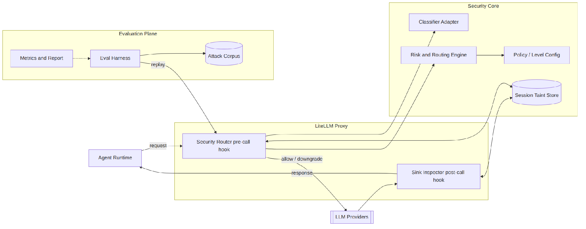
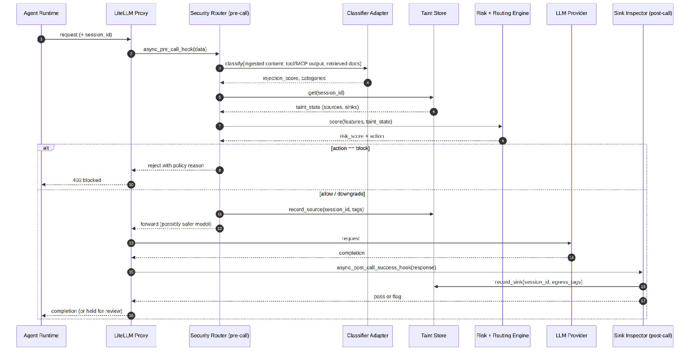
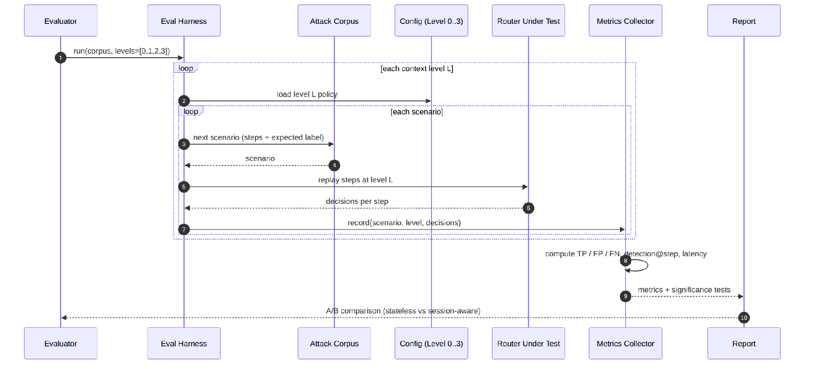

# SecureLiteLLM — Architecture

## High-Level Architecture

The system is security middleware that lives inside the LiteLLM proxy. It intercepts agent traffic on the way to the model (pre-call) and on the way back (post-call), scores each request against both its own content and accumulated per-agent-run state, and routes on risk rather than cost.

The agent's request enters through the pre-call hook; the security core scores it against the taint store; the response leaves through the post-call hook, which feeds what it learns back into that store. The evaluation plane replays attack scenarios through the exact same path so results are directly comparable.

---

## UC-1 — Runtime Interception (Content-Borne Composition Attack)

Sequence of a live request through the system:

1. Agent sends request with session ID
2. `async_pre_call_hook` fires on the Security Router
3. Classifier Adapter scans ingested content (tool/MCP outputs, retrieved docs)
4. Taint Store returns accumulated source/sink state for the session
5. Risk + Routing Engine fuses content score + taint state → `risk_score + action`
6. **If block:** proxy rejects with policy reason; agent receives 403
7. **If allow/downgrade:** source recorded, request forwarded (possibly to safer model)
8. `async_post_call_success_hook` fires; Sink Inspector records egress tags
9. Response passed or flagged; agent receives completion (or held for review)

---

## UC-2 — Controlled A/B Evaluation

The same routing pipeline is used to generate evaluation data across all four context-richness levels (L0–L3):

1. Evaluator calls `run(corpus, levels=[0,1,2,3])`
2. For each level: load level policy → Config
3. For each scenario in Attack Corpus: replay steps through Router Under Test
4. Metrics Collector records decisions per step; computes TP / FP / FN, detection@step, latency
5. Significance tests run; output is a clean A/B comparison (stateless vs session-aware)

---

## Components & Key Interfaces

| # | Component | Responsibility | Key Interface |
|---|-----------|---------------|---------------|
| 1 | **LiteLLM Proxy** | Host process; provides hook extension points | `async_pre_call_hook(user_api_key_dict, cache, data, call_type)`; `async_post_call_success_hook(...)` |
| 2 | **Security Router** | Custom callback class; orchestrates the pre-call decision | Implements LiteLLM `CustomLogger` / proxy hooks |
| 3 | **Classifier Adapter** | Wraps off-the-shelf classifiers; scans ingested content (tool/MCP outputs, retrieved docs) for content-borne injection | `classify(text) -> {label, score, categories}` |
| 4 | **Session Taint Store** | Per-agent-run source/sink state (lightweight taint, not history pooling) | `get(session_id)`; `record_source(...)`; `record_sink(...)`; `state(session_id)` |
| 5 | **Risk + Routing Engine** | Fuse content score + taint state into composition risk | `score(features, taint_state) -> RiskScore` |
| 6 | **Routing Policy** | Map risk to action at the active level | `decide(risk_score, level) -> Action` |
| 7 | **Sink Inspector** | Post-call egress inspection; closes the taint loop | `inspect(response) -> egress_tags` |
| 8 | **Config / Level Loader** | Selects context-richness Level 0–3, thresholds | YAML + Pydantic schema |
| 9 | **Attack Corpus** | Versioned scenarios tagged to taxonomy | YAML/JSON: `{steps[], expected_label, taxonomy_ref}` |
| 10 | **Eval Harness** | Replay corpus, collect metrics, run significance tests | `run(corpus, level) -> Metrics`; `report(metrics)` |
